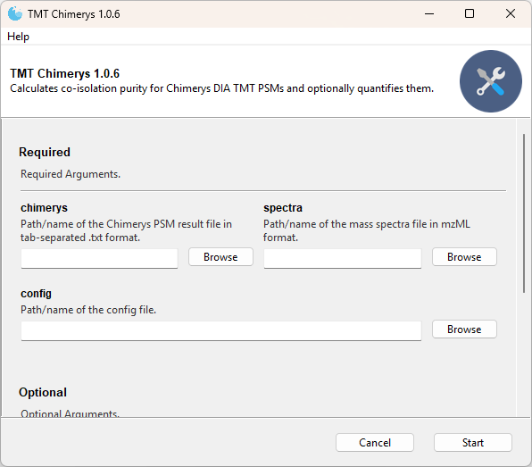

# TMT

TMTpro-18plex quantification for \[single cell\] DIA and DDA searches with
[Chimerys](https://www.msaid.de/chimerys),
[Spectronaut](https://biognosys.com/software/spectronaut/), and
[DIA-NN](https://github.com/vdemichev/DiaNN).

## Usage

- On Microsoft Windows the applications can be run as standalone executables or as python scripts.
- Other operating systems are limited to the python scripts, please refer to [CLI.md](CLI.md).

### Graphical User Interface

We provide compiled binaries for Microsoft Windows that offer a graphical user interface. Please download the executables from
either [releases](https://github.com/hgb-bin-proteomics/TMT/releases) or in zipped form from the
[binaries](https://github.com/hgb-bin-proteomics/TMT/tree/master/binaries) folder.

> [!IMPORTANT]
>
> Please make sure that the executable and the `tmt18plex_default.ini` file are in the same directory.

### Commandline Interface

Please refer to [CLI.md](CLI.md).
